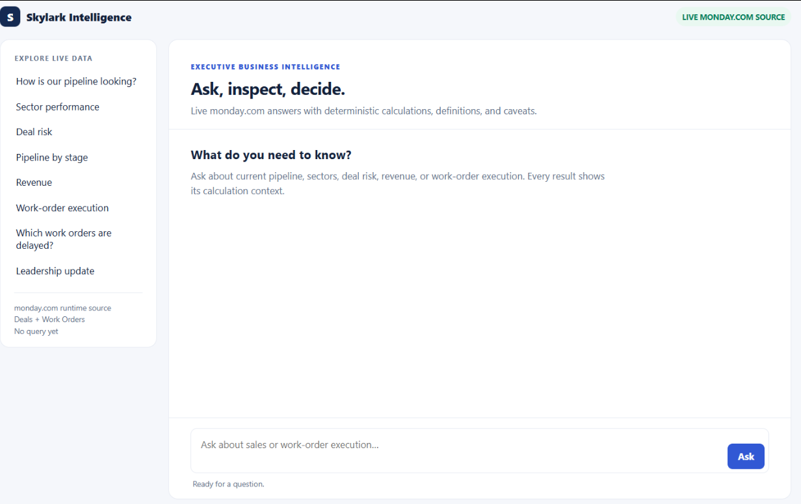
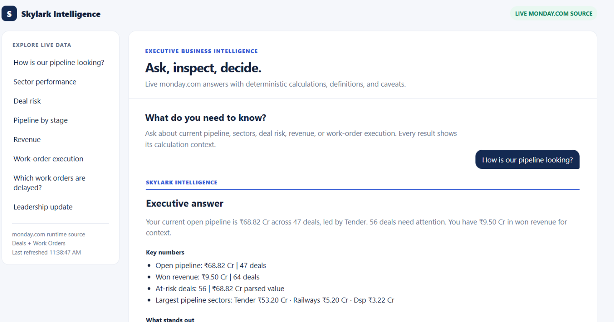
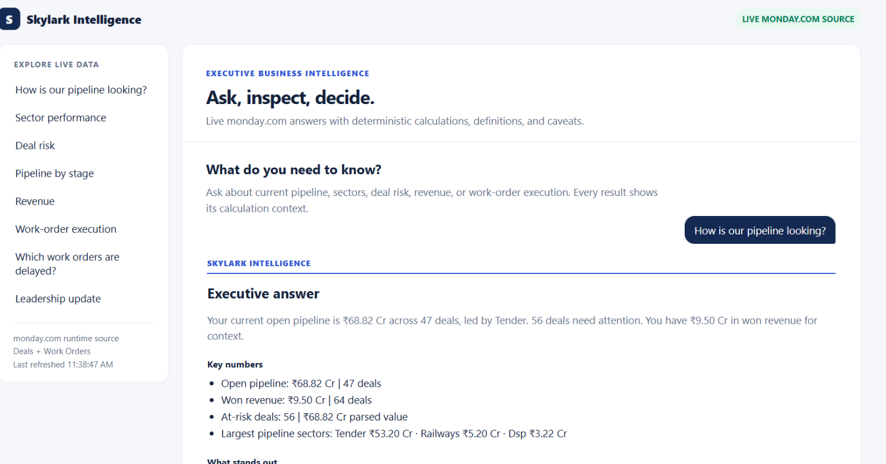
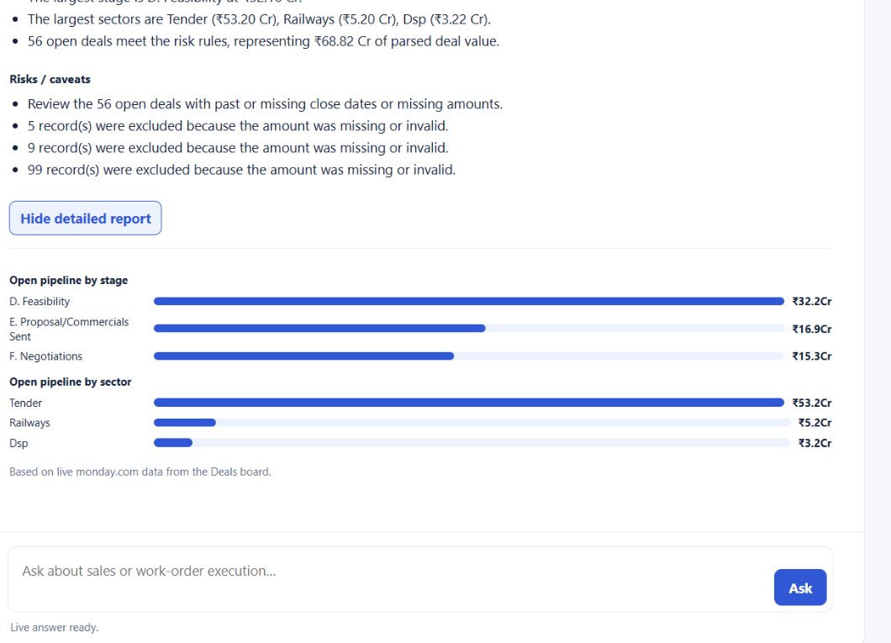
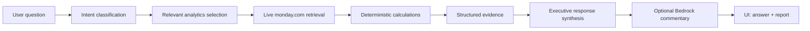

# Skylark Intelligence

<div align="center">
  
</div>

<div align="center">
  <h3>
    <a href="#">Flutter</a>
    <span> · </span>
    <a href="#">Node.js</a>
    <span> · </span>
    <a href="#">monday.com API</a>
    <span> · </span>
    <a href="#">Amazon Bedrock</a>
  </h3>
</div>

A founder-facing business intelligence assistant for live monday.com sales and work-order data.

Skylark Intelligence turns raw operational data into fast executive answers. It blends deterministic calculations with optional AI-driven interpretation so leaders can ask natural-language questions and get a concise, evidence-backed answer instead of a dashboard dump.

## Why this project exists

Most BI tools require users to build dashboards, inspect multiple views, and manually connect the dots. Skylark Intelligence is designed for a different pattern:

- ask a plain-English business question,
- retrieve the relevant monday.com data,
- calculate the answer deterministically,
- surface the key numbers and risk signals,
- present a crisp executive narrative with supporting evidence.

This makes it especially useful for founders, operators, and leadership teams who need fast answers about pipeline health, deal risk, work-order execution, and business momentum.

## Product preview

<div align="center">
  <table>
    <tr>
      <td align="center">
        
        <br />
        <sub>Executive overview</sub>
      </td>
      <td align="center">
        
        <br />
        <sub>AI answer with key metrics</sub>
      </td>
    </tr>
    <tr>
      <td align="center">
        
        <br />
        <sub>Detailed report</sub>
      </td>
      <td align="center">
        
        <br />
        <sub>Risk and execution view</sub>
      </td>
    </tr>
  </table>
</div>

## Core capabilities

- Natural-language question answering over live monday.com data
- Deterministic pipeline, revenue, stage, and sector metrics
- Risk detection for stalled, incomplete, or unusually large deals
- Executive response structure: direct answer, key numbers, insights, caveats
- Optional AI commentary layered on top of verified numbers
- Interactive visual summary for detailed drill-down analysis

## Design principles

The product is intentionally built around a few clear principles:

- **Numbers stay deterministic**: the model never calculates the figures; the code does.
- **Answers are concise and executive-ready**: users get a direct answer first, not a data dump.
- **Evidence remains auditable**: metrics, exclusions, caveats, and source context stay visible.
- **Missing data is explicit**: gaps are reported instead of silently converted to zeros.
- **Visuals remain honest**: charts reflect validated analytics output.
- **The interface is progressive**: answer first, explanation second, detail on demand.

## Architecture

Skylark Intelligence follows a simple, traceable architecture:



### Runtime components

- `public/index.html`: browser UI for the query composer, answer card, and report visuals.
- `src/server.js`: same-origin HTTP server and JSON API.
- `src/query.js`: request orchestration, intent routing, evidence collection, and response synthesis.
- `src/analytics.js`: deterministic metrics, filters, and data-quality logic.
- `src/normalization.js`: amount, date, status, and label normalization.
- `src/schema.js`: canonical mapping for monday.com board fields.
- `src/monday.js`: read-only monday.com GraphQL client with pagination and timeouts.
- `src/bedrock.js`: optional, server-side qualitative commentary layer.

## Data sources

The application uses monday.com as its live operational data source. It currently supports two configured boards:

- **Deals**: open pipeline, pipeline by stage, pipeline by sector, won revenue, top deals, and risky deals.
- **Work Orders**: active, completed, and delayed execution views.

Schema discovery happens dynamically from the live board structure. When a field is ambiguous or invalid, it is excluded with explicit caveats rather than silently converted to a misleading value.

## Quick start

Run the following in PowerShell:

```powershell
cd "C:\Users\prajw\OneDrive\Documents\Project\Business-Intelligence-Agent"
npm install
Copy-Item .env.example .env
notepad .env
npm test
npm start
```

Then open [http://localhost:3000](http://localhost:3000).

For live development with automatic restarts:

```powershell
npm run dev
```

## Environment setup

Requirements:

- Node.js 18 or later
- npm
- A monday.com read-capable API token
- Deal and Work Order board IDs
- Optional Bedrock access for commentary enhancement

Minimum `.env` configuration:

```env
MONDAY_API_TOKEN=your_monday_read_token
MONDAY_DEALS_BOARD_ID=your_deals_board_id
MONDAY_WORK_ORDERS_BOARD_ID=your_work_orders_board_id
MONDAY_API_VERSION=2025-10
PORT=3000
CACHE_TTL_MS=30000
```

## Optional Bedrock enhancement

Bedrock is deliberately optional. When enabled, it adds qualitative commentary such as concentration, momentum, and areas to watch. It does not own or replace the business calculations.

```env
AWS_BEDROCK_ENABLED=true
AWS_BEARER_TOKEN_BEDROCK=your_bedrock_api_key
AWS_BEDROCK_REGION=us-east-1
AWS_BEDROCK_MODEL_ID=us.anthropic.claude-sonnet-4-6
AWS_BEDROCK_TIMEOUT_MS=20000
```

Operating rules:

- Missing or disabled key: deterministic output still works
- Timeout or service error: deterministic output still works
- Numeric claims in commentary: discarded unless verified
- API key: never returned to the browser or logged

## Example questions

Open the app and ask questions such as:

- `How is our pipeline looking?`
- `Which deals are risky?`
- `Show pipeline by sector`
- `What are the largest deals?`
- `Which work orders are delayed?`
- `How are operations doing?`

## Current pipeline example

A live pipeline overview is synthesized from the relevant analytics only:

```text
Your current open pipeline is ₹68.82 Cr across 47 deals, led by Tender.
56 deals need attention. You have ₹9.50 Cr in won revenue for context.
```

Internal identifiers such as `open_pipeline`, `risky_deals`, and `pipeline_by_sector` remain in the backend evidence and are not shown in the final user-facing answer.

## API endpoints

### Health

```http
GET /api/health
```

Returns a simple service status and request identifier.

### Schema inspection

```http
GET /api/schema
```

Returns board names, record counts, discovered fields, retrieval timestamps, and cache state.

### Business query

```http
POST /api/query
Content-Type: application/json

{"question":"How is our pipeline looking?"}
```

The response may include:

- `response.direct_answer`
- `response.key_numbers`
- `response.observations`
- `response.risks`
- `response.caveats`
- `response.visualization`
- optional `response.ai_analysis`
- `response.source_note`
- structured evidence used to support the answer

## Security and governance

- `.env` stays local and is not committed.
- monday.com and Bedrock credentials remain server-side only.
- The monday adapter is read-only.
- Correlation IDs are logged for traceability, but tokens and secret-bearing prompts are excluded.
- Error responses are sanitized and do not expose stack traces.
- Any credential leaked into chat, screenshots, or commits should be rotated immediately.

## Validation

Run the deterministic test suite:

```powershell
node --test
```

Check the backend health and schema:

```powershell
Invoke-WebRequest http://localhost:3000/api/health
Invoke-WebRequest http://localhost:3000/api/schema
```

Test a founder query:

```powershell
$body = @{ question = "How is our pipeline looking?" } | ConvertTo-Json
Invoke-WebRequest `
  -Uri http://localhost:3000/api/query `
  -Method Post `
  -ContentType "application/json" `
  -Body $body
```

## Summary

Skylark Intelligence is designed for fast decision support in revenue operations, pipeline management, and execution oversight. It emphasizes trust, traceability, and speed—so business leaders can ask better questions and get reliable answers with evidence behind them.

